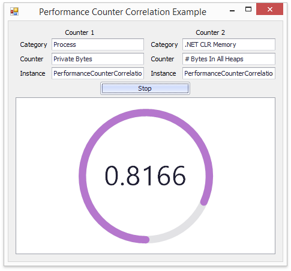

<!-- default badges list -->

<!-- default badges end -->

# Spreadsheet Document API - Use Worksheet Data Bindings to Log and Process Data

This example illustrates the use of the [DevExpress.Spreadsheet.Workbook](https://docs.devexpress.com/OfficeFileAPI/DevExpress.Spreadsheet.Workbook) instance to perform the calculations on data bound to an external data source. The calculation result is located in the cell exposed as the data source for the [DevExpress.XtraGauges.Win.GaugeControl](https://docs.devexpress.com/WindowsForms/DevExpress.XtraGauges.Win.GaugeControl) control.

## Implementation Details

The source data are pairs of System.Diagnostics.PerformanceCounter object values. Performance samples (TwoCounterSample objects) are collected at the time interval specified by the timer. The samples are stored in the collection. A `WorksheetProcessor` object instance is created to process the collection of samples. A `WorksheetProcessor` includes a [Workbook](https://docs.devexpress.com/OfficeFileAPI/DevExpress.Spreadsheet.Workbook)  instance with a [Worksheet](https://docs.devexpress.com/OfficeFileAPI/DevExpress.Spreadsheet.Worksheet) sheet containing a table bound to the performance data collection. The [TableCollection.Add](https://docs.devexpress.com/OfficeFileAPI/devexpress.spreadsheet.tablecollection.add.overloads) method is used to create a table bound to data.
The **CORREL** [statistical function](https://docs.devexpress.com/OfficeFileAPI/15067/spreadsheet-document-api/formulas/functions/statistical-functions) calculates the correlation coefficient. The cell containing the calculation result is exposed as the data source using the [CellRange.GetDataSource](https://docs.devexpress.com/OfficeFileAPI/DevExpress.Spreadsheet.CellRange.GetDataSource.overloads) method.
The worksheet data source providing a correlation coefficient value is bound to the [Gauges.Circular.ArcScaleComponent.DataBindings](https://docs.devexpress.com/WindowsForms/DevExpress.XtraGauges.Win.Gauges.Circular.ArcScaleComponent.DataBindings) and [LabelComponent.DataBindings](https://docs.devexpress.com/WindowsForms/DevExpress.XtraGauges.Win.Base.LabelComponent.DataBindings) collections of the [circular gauge](https://docs.devexpress.com/WindowsForms/18225/controls-and-libraries/gauges/concepts/gauge-types/circular-gauges) control. The gauge control shows the correlation dynamically.

## Files to Review

* [Form1.cs](./CS/PerformanceCounterCorrelationExample/Form1.cs) (VB: [Form1.vb](./VB/PerformanceCounterCorrelationExample/Form1.vb))
* [PerformanceDataProvider.cs](./CS/PerformanceCounterCorrelationExample/PerformanceDataProvider.cs) (VB: [PerformanceDataProvider.vb](./VB/PerformanceCounterCorrelationExample/PerformanceDataProvider.vb))
* [TwoCounterSample.cs](./CS/PerformanceCounterCorrelationExample/TwoCounterSample.cs) (VB: [TwoCounterSample.vb](./VB/PerformanceCounterCorrelationExample/TwoCounterSample.vb))
* [WorksheetProcessor.cs](./CS/PerformanceCounterCorrelationExample/WorksheetProcessor.cs) (VB: [WorksheetProcessor.vb](./VB/PerformanceCounterCorrelationExample/WorksheetProcessor.vb))
<!-- feedback -->
## Does this example address your development requirements/objectives?

 

(you will be redirected to DevExpress.com to submit your response)
<!-- feedback end -->
